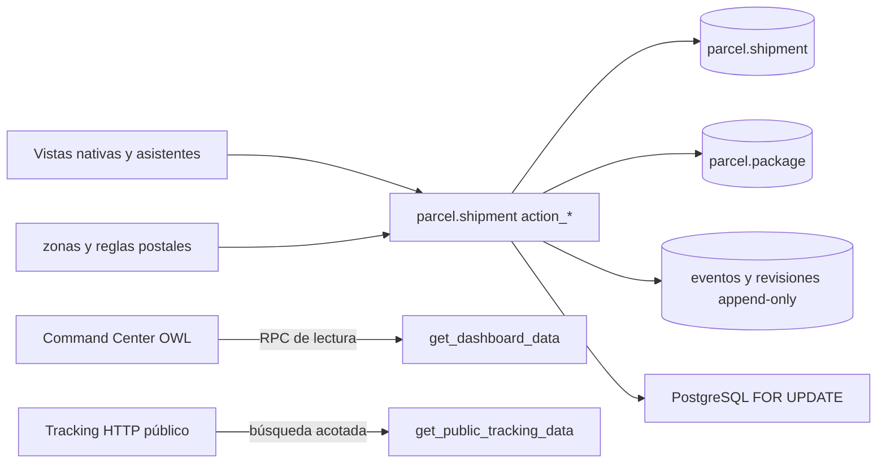
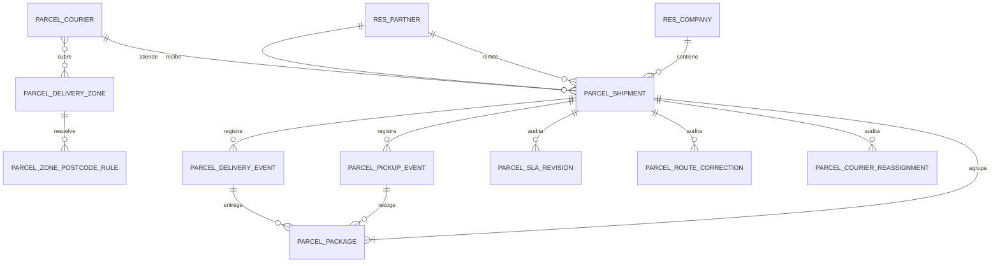
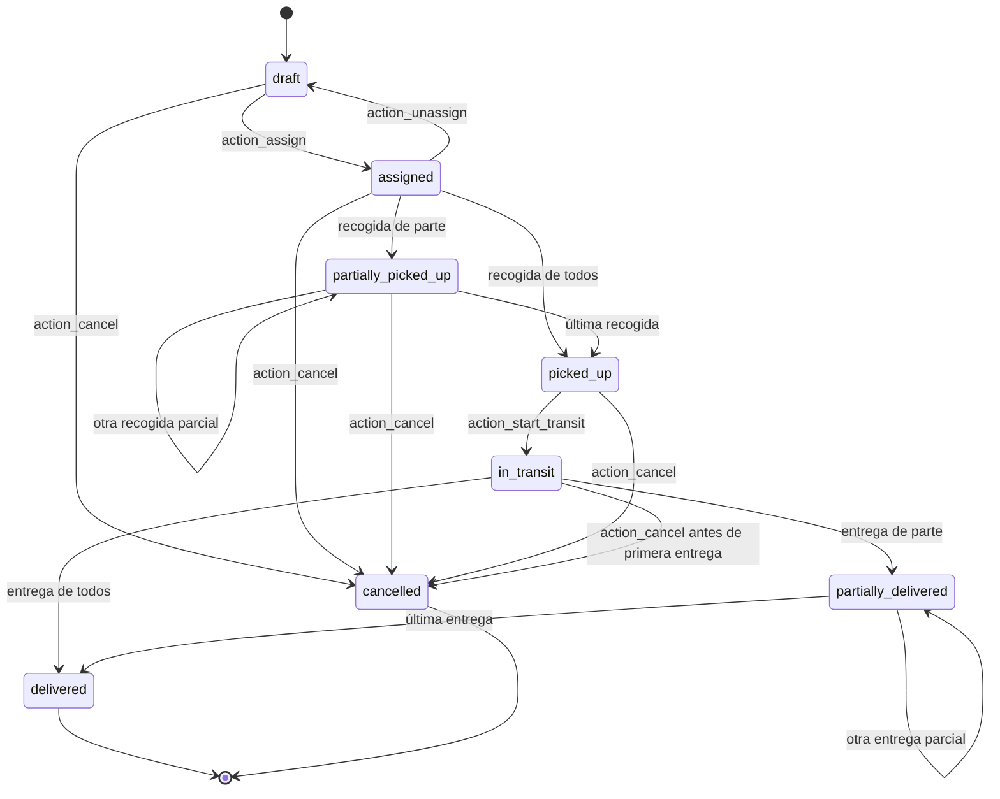

# Especificación funcional y técnica

## Parcel Transport Management para Odoo Community 19

| Metadato          | Valor                                                                                                         |
| ----------------- | ------------------------------------------------------------------------------------------------------------- |
| Módulo            | `parcel_transport_management`                                                                                 |
| Versión declarada | `19.0.1.0.0`                                                                                                  |
| Plataforma        | Odoo Community 19                                                                                             |
| Licencia          | LGPL-3                                                                                                        |
| Fuente de verdad  | Código, datos, seguridad y pruebas del repositorio                                                            |
| Manifiesto        | [`addons/parcel_transport_management/__manifest__.py`](../addons/parcel_transport_management/__manifest__.py) |

## 1. Propósito y lenguaje normativo

El módulo gestiona envíos de uno o varios paquetes desde su preparación hasta su
entrega o cancelación. El dominio se implementa en modelos Python; las vistas,
los asistentes y el Command Center invocan operaciones de dominio y no son la
fuente de verdad del estado.

En este documento:

- **MUST** identifica un requisito obligatorio y verificable. Su incumplimiento
  invalida el contrato.
- **SHOULD** identifica una práctica esperada salvo razón técnica documentada.
- **MAY** identifica comportamiento opcional que no altera las garantías
  obligatorias.

Los verbos se mantienen en mayúsculas para distinguir requisitos normativos de
explicaciones descriptivas.

## 2. Alcance

### 2.1 Incluido

El sistema MUST proporcionar:

1. alta y preparación de envíos multi-paquete;
2. referencias de envío y códigos opacos de tracking generados en servidor;
3. asignación, desasignación y reasignación de repartidores;
4. capacidad simultánea por número de envíos y por peso convertido;
5. recogidas y entregas totales o parciales por paquete;
6. estados derivados de operaciones válidas, no editables manualmente;
7. zonas por empresa y país, resueltas mediante prefijos postales;
8. SLA inicial por zona, revisión auditada y cálculo de retraso;
9. snapshots históricos de direcciones y correcciones de ruta auditadas;
10. eventos y revisiones append-only;
11. aislamiento multiempresa y permisos por rol;
12. tracking público HTML con una lista blanca mínima de datos;
13. un dashboard operativo de solo lectura y con resultados acotados;
14. vistas nativas, asistentes, traducción española y datos demo reproducibles;
15. despliegue local mediante contenedores con imágenes fijadas por digest.

### 2.2 No alcance y no objetivos

Los siguientes elementos NO forman parte del contrato:

- GIS, geocodificación, navegación, GPS, telemetría de vehículos, coordenadas,
  distancias, mapas geográficos o cálculo y optimización de rutas. El Command
  Center es una red operativa abstracta: cola, carriles agregados origen-destino,
  presión de zonas destino, repartidores y actividad;
- integración con transportistas externos, etiquetas, aduanas, tarifas,
  facturación, pagos, inventario o firma electrónica;
- aplicación móvil nativa u operación sin conexión;
- notificaciones SMS, correo o webhooks como resultado de las transiciones;
- API pública JSON. El tracking público es una página HTTP renderizada;
- búsqueda pública por remitente, destinatario, referencia de envío o datos
  personales;
- previsión de demanda, algoritmos de asignación automática o reequilibrio de
  carga;
- edición retroactiva de eventos operativos;
- pruebas pixel-perfect, de posiciones exactas, colores, iconos o XML puramente
  visual;
- un porcentaje de cobertura. El recuento de pruebas ejecutadas no equivale a
  una métrica de cobertura.

La UI MAY evolucionar visualmente sin cambiar el contrato de dominio, seguridad
o DTO descrito aquí.

## 3. Arquitectura y límites de responsabilidad



- La lógica de negocio MUST residir en los modelos de
  [`models/`](../addons/parcel_transport_management/models/).
- Los asistentes de [`wizards/`](../addons/parcel_transport_management/wizards/)
  MUST delegar en `action_*`.
- Las vistas de [`views/`](../addons/parcel_transport_management/views/) SHOULD
  exponer operaciones y datos sin duplicar validaciones críticas.
- El cliente OWL
  [`ParcelCommandCenter`](../addons/parcel_transport_management/static/src/js/parcel_dashboard.js)
  MUST ser de lectura respecto al dominio.
- El controlador público
  [`ParcelPublicTracking`](../addons/parcel_transport_management/controllers/tracking.py)
  MUST publicar exclusivamente el DTO permitido.

Dependencias declaradas: `base`, `mail`, `uom`, `web` y `website`; véase el
[manifiesto](../addons/parcel_transport_management/__manifest__.py).

## 4. Actores, permisos y propiedad

### 4.1 Actores

| Actor                 | Identidad                                             | Responsabilidad                                                                                    |
| --------------------- | ----------------------------------------------------- | -------------------------------------------------------------------------------------------------- |
| Visitante público     | Usuario público de `website`                          | Consultar un paquete por código de tracking                                                        |
| Courier               | `group_ptm_courier` y perfil `parcel.courier.user_id` | Operar únicamente sus envíos asignados                                                             |
| Operator              | `group_ptm_operator`                                  | Preparar envíos, repartidores, asignaciones y operaciones de cualquier envío visible de la empresa |
| Manager               | `group_ptm_manager`, que implica Operator             | Cancelar, revisar SLA, corregir ruta, reasignar en vivo y administrar zonas                        |
| Administrador técnico | `base.group_system`                                   | Configuración de empresa, instalación y actualización                                              |

Los grupos se definen en
[`security/parcel_security.xml`](../addons/parcel_transport_management/security/parcel_security.xml)
y los permisos CRUD en
[`security/ir.model.access.csv`](../addons/parcel_transport_management/security/ir.model.access.csv).

### 4.2 Matriz funcional de permisos

| Capacidad                          | Público |                       Courier |                Operator |                      Manager |  Administrador técnico |
| ---------------------------------- | ------: | ----------------------------: | ----------------------: | ---------------------------: | ---------------------: |
| Tracking HTML de un código         |      Sí |                            Sí |                      Sí |                           Sí |                     Sí |
| Leer envíos y paquetes             |      No |                  Solo propios |       Empresa permitida |            Empresa permitida |      Según ACL de Odoo |
| Crear envío                        |      No |                            No |                      Sí |                           Sí |      Según ACL de Odoo |
| Editar datos de borrador           |      No |             No en la práctica |                      Sí |                           Sí |      Según ACL de Odoo |
| Eliminar envío                     |      No |                            No |                      No |                Solo borrador |      Según ACL de Odoo |
| Asignar/desasignar                 |      No |                            No |                      Sí |                           Sí |      Según ACL de Odoo |
| Reasignar antes de recogida        |      No |                            No |                      Sí |                           Sí |      Según ACL de Odoo |
| Reasignar tras iniciar operaciones |      No |                            No |                      No |               Sí, con motivo |      Según ACL de Odoo |
| Registrar recogida/entrega         |      No |        Solo asignados propios |                      Sí |                           Sí |      Según ACL de Odoo |
| Iniciar tránsito                   |      No |        Solo asignados propios |                      Sí |                           Sí |      Según ACL de Odoo |
| Cancelar                           |      No |                            No |                      No | Sí, antes de primera entrega |      Según ACL de Odoo |
| Revisar SLA/corregir ruta          |      No |                            No |                      No |                           Sí |      Según ACL de Odoo |
| Administrar repartidores           |      No | Perfil propio de solo lectura | Crear/editar, no borrar |                         CRUD |      Según ACL de Odoo |
| Administrar zonas/reglas postales  |      No |                       Lectura |                 Lectura |                         CRUD |      Según ACL de Odoo |
| Leer histórico                     |      No |     Solo el de envíos propios |       Empresa permitida |            Empresa permitida |      Según ACL de Odoo |
| Modificar/eliminar histórico       |      No |                            No |                      No |                           No | No mediante ORM normal |

La concesión CRUD por ACL no autoriza por sí sola una transición. Los métodos
`_require_dispatch_access`, `_require_operational_access` y
`_require_manager_access` de
[`models/shipment.py`](../addons/parcel_transport_management/models/shipment.py)
MUST aplicar la autorización contextual. En particular, la creación declarativa
de eventos o reasignaciones no permite falsificar actor, fecha, paquetes ni
estado.

### 4.3 Reglas de registro

- Todos los modelos empresariales MUST aplicar `company_id in company_ids`.
- Un Courier MUST ver envíos, paquetes e históricos únicamente cuando
  `courier_id.user_id == user.id`.
- Un Courier MUST ver solo su propio perfil.
- Operator y Manager MUST conservar visibilidad global dentro de sus empresas
  permitidas, incluso si el usuario también pertenece al grupo Courier.
- Las reglas globales y de rol se encuentran en
  [`parcel_security.xml`](../addons/parcel_transport_management/security/parcel_security.xml).

## 5. Modelo de datos



### 5.1 Entidades y campos críticos

| Modelo                        | Campos críticos                                                                                                                     | Restricciones y finalidad                                           |
| ----------------------------- | ----------------------------------------------------------------------------------------------------------------------------------- | ------------------------------------------------------------------- |
| `parcel.shipment`             | `reference`, `company_id`, `sender_id`, `recipient_id`, `courier_id`, `package_ids`, `state`                                        | Referencia única de servidor; empresa inmutable; agregado operativo |
| `parcel.shipment`             | `pickup_*`, `delivery_*`, `origin_zone_id`, `destination_zone_id`, `coverage_warning`                                               | Snapshot de ruta y cobertura                                        |
| `parcel.shipment`             | `expected_delivery_at`, `original_expected_delivery_at`, `first_picked_up_at`, `transit_started_at`, `delivered_at`, `cancelled_at` | SLA y marcas temporales controladas                                 |
| `parcel.shipment`             | `delay_hours`, `original_delay_hours`, `total_weight_kg`                                                                            | Valores calculados                                                  |
| `parcel.package`              | `shipment_id`, `company_id`, `tracking_code`, `weight`, `weight_uom_id`, `weight_kg`                                                | Código global único; peso positivo y convertible                    |
| `parcel.package`              | `pickup_event_id`, `delivery_event_id`                                                                                              | Máximo un enlace de cada tipo por paquete                           |
| `parcel.courier`              | `company_id`, `user_id`, `availability`, `active`, `zone_ids`                                                                       | Perfil y disponibilidad; usuario único por empresa                  |
| `parcel.courier`              | `max_concurrent_shipments`, `max_concurrent_weight`, `max_weight_uom_id`                                                            | Capacidad dual estrictamente positiva                               |
| `parcel.delivery.zone`        | `name`, `active`, `code`, `default_sla_hours`                                                                                       | Cobertura lógica, presión operativa y SLA positivo                  |
| `parcel.zone.postcode.rule`   | `zone_id`, `country_id`, `postcode_prefix`                                                                                          | Prefijo normalizado y único por empresa/país                        |
| `parcel.pickup.event`         | envío, repartidor, actor, fecha, nota, paquetes                                                                                     | Hecho de recogida append-only                                       |
| `parcel.delivery.event`       | envío, repartidor, actor, fecha, receptor, nota, paquetes                                                                           | Hecho de entrega append-only                                        |
| `parcel.sla.revision`         | SLA anterior/nuevo, motivo, actor, fecha                                                                                            | Revisión append-only                                                |
| `parcel.route.correction`     | valores anteriores/nuevos, zonas anteriores/nuevas, `applied`, motivo, actor, fecha                                                 | Corrección aplicada o anotación terminal                            |
| `parcel.courier.reassignment` | repartidor anterior/nuevo, motivo, actor, fecha                                                                                     | Historial exacto de cambio de repartidor                            |
| `res.company`                 | máximos de paquete y valores predeterminados de capacidad y unidades                                                                | Configuración aislada por empresa                                   |

Definiciones: [`shipment.py`](../addons/parcel_transport_management/models/shipment.py),
[`package.py`](../addons/parcel_transport_management/models/package.py),
[`courier.py`](../addons/parcel_transport_management/models/courier.py),
[`zone.py`](../addons/parcel_transport_management/models/zone.py),
[`events.py`](../addons/parcel_transport_management/models/events.py),
[`revisions.py`](../addons/parcel_transport_management/models/revisions.py),
[`reassignment.py`](../addons/parcel_transport_management/models/reassignment.py) y
[`res_company.py`](../addons/parcel_transport_management/models/res_company.py).

## 6. Máquina de estados



### 6.1 Transiciones obligatorias

| Operación                | Precondiciones MUST                                                                                                  | Resultado MUST                                                         |
| ------------------------ | -------------------------------------------------------------------------------------------------------------------- | ---------------------------------------------------------------------- |
| `action_assign`          | Estado `draft`; al menos un paquete; Courier válido, activo, disponible, de la misma empresa y con ambas capacidades | `assigned`; repartidor fijado; SLA inicial comprometido cuando proceda |
| `action_unassign`        | Estado `assigned`; Operator o Manager                                                                                | `draft`; repartidor liberado                                           |
| `action_reassign`        | Estado reservado; nuevo Courier válido, disponible y con capacidad                                                   | Cambia repartidor y crea historial si existe cambio real               |
| `action_record_pickup`   | Estado `assigned` o `partially_picked_up`; paquetes del envío, aún no recogidos; actor autorizado                    | Evento único y estado parcial o `picked_up`                            |
| `action_start_transit`   | Estado `picked_up`; todos los paquetes recogidos; repartidor asignado                                                | `in_transit` y `transit_started_at` de servidor                        |
| `action_record_delivery` | Estado `in_transit` o `partially_delivered`; paquetes recogidos y no entregados; receptor no vacío                   | Evento único y estado parcial o `delivered`                            |
| `action_cancel`          | Manager; motivo; no `delivered`, no `cancelled` y ningún paquete entregado                                           | `cancelled`, motivo y fecha de servidor                                |
| `action_revise_sla`      | Manager; envío no terminal; SLA existente; fecha válida y diferente; motivo                                          | Cambia SLA actual y añade revisión                                     |
| `action_correct_route`   | Manager; campos de snapshot permitidos y motivo                                                                      | Recalcula zonas; aplica si no terminal y siempre añade auditoría       |

Los estados parciales MUST derivarse del conjunto de enlaces de evento de los
paquetes. La UI MUST NOT ofrecer escritura manual ni drag-and-drop de estados.
Los kanban de envíos, paquetes, repartidores y zonas usan
`records_draggable="false"`; véanse
[`parcel_shipment_views.xml`](../addons/parcel_transport_management/views/parcel_shipment_views.xml),
[`parcel_package_views.xml`](../addons/parcel_transport_management/views/parcel_package_views.xml),
[`parcel_courier_views.xml`](../addons/parcel_transport_management/views/parcel_courier_views.xml)
y
[`parcel_zone_views.xml`](../addons/parcel_transport_management/views/parcel_zone_views.xml).

## 7. Invariantes de dominio

### 7.1 Paquetes y tracking

1. Un envío MUST contener al menos un paquete al asignarse.
2. Los paquetes MAY crearse, cambiarse o eliminarse solo mientras el envío está
   en `draft`.
3. `weight` MUST ser finito en la práctica de conversión, estrictamente positivo
   y usar una unidad de la categoría peso.
4. El peso convertido sin redondeo MUST ser menor o igual al máximo configurado
   en la empresa.
5. `tracking_code` MUST ser globalmente único, generado por servidor y no
   aceptado desde el cliente.
6. El formato canónico MUST ser `PTM-XXXX-XXXX-XXXX-XXXX`, con 16 símbolos del
   alfabeto `23456789ABCDEFGHJKLMNPQRSTUVWXYZ`.
7. `shipment_id`, `company_id`, `pickup_event_id` y `delivery_event_id` MUST NOT
   modificarse por escritura directa.
8. Cada paquete MUST vincular como máximo un evento de recogida y uno de entrega.
9. Un paquete MUST NOT entregarse antes de haber sido recogido.

Implementación: `ParcelPackage` en
[`models/package.py`](../addons/parcel_transport_management/models/package.py).

### 7.2 Peso y doble capacidad

Los envíos en `assigned`, `partially_picked_up`, `picked_up`, `in_transit` y
`partially_delivered` MUST reservar capacidad. `delivered`, `cancelled` y
`draft` no reservan capacidad.

Para un repartidor y un conjunto candidato, la asignación MUST satisfacer a la
vez:

\[
\text{envíos reservados} + \text{candidatos}
\leq \text{max\_concurrent\_shipments}
\]

\[
\sum \text{peso convertido de reservados y candidatos}
\leq \text{max\_concurrent\_weight}
\]

- La conversión MUST usar `uom.uom._compute_quantity(..., round=False)`.
- Los límites y sus unidades MUST ser estrictamente positivos y compatibles con
  peso.
- Un repartidor archivado o `unavailable` MUST NOT recibir una asignación o
  reasignación nueva.
- Una entrega parcial MUST conservar toda la reserva del envío hasta la entrega
  final.
- La reasignación MUST comprobar la capacidad del nuevo repartidor y, si falla,
  MUST conservar asignación e histórico previos por rollback transaccional.

Implementación: `_check_courier_capacity` y `_shipment_weight_in_uom` en
[`shipment.py`](../addons/parcel_transport_management/models/shipment.py), y
`_compute_current_load` en
[`courier.py`](../addons/parcel_transport_management/models/courier.py).

### 7.3 Fechas y SLA

1. Actor y fecha de eventos, revisiones y reasignaciones MUST ser de servidor.
2. `first_picked_up_at` MUST fijarse una sola vez con el primer evento de
   recogida.
3. `transit_started_at` MUST fijarse al iniciar tránsito.
4. `delivered_at` MUST coincidir con el evento que completa todos los paquetes.
5. `cancelled_at` MUST fijarse al cancelar.
6. Si el envío no trae `expected_delivery_at`, la primera asignación SHOULD usar
   `now + destination_zone.default_sla_hours` cuando exista zona destino.
7. En la primera asignación, `original_expected_delivery_at` MUST copiar el SLA
   comprometido y MUST NOT cambiar con revisiones posteriores.
8. `delay_hours` y `original_delay_hours` MUST ser `max(0, delivered_at - SLA)`
   en horas y cero antes de entrega.
9. Una revisión de SLA MUST requerir valor interpretable, distinto del actual y
   motivo no vacío; MUST NOT aplicarse en `delivered` o `cancelled`.
10. El contrato actual NO exige que el SLA inicial o revisado esté en el futuro;
    los SLA ya vencidos son válidos y alimentan la detección de retraso.

### 7.4 Direcciones, zonas y cobertura

1. Al crear el envío, nombres, calles, ciudades, códigos postales y países MUST
   copiarse desde remitente y destinatario a campos snapshot.
2. Cambiar `sender_id` o `recipient_id` MAY rehacer el snapshot únicamente en
   `draft` y de uno en uno.
3. Cambios posteriores en `res.partner` MUST NOT alterar el snapshot histórico.
4. Los campos snapshot MUST NOT aceptar escritura directa normal.
5. Solo Manager MAY corregirlos mediante `action_correct_route`, con motivo y
   lista cerrada `ROUTE_SNAPSHOT_FIELDS`.
6. En un envío activo, la corrección MUST recalcular zonas y cobertura; en un
   envío terminal MUST registrarse con `applied=False` sin alterar la ruta.
7. Los códigos postales MUST normalizarse eliminando espacios y convirtiendo a
   mayúsculas.
8. La regla MUST ser única por empresa, país y prefijo.
9. La resolución MUST elegir el prefijo activo más largo que coincida.
10. Origen y destino MUST resolverse de forma independiente.
11. Falta de cobertura o cobertura incompleta del repartidor SHOULD producir
    `coverage_warning` y nota en chatter, pero MUST NOT bloquear el envío.
12. Archivar una zona MAY cambiar resoluciones futuras, pero MUST NOT reescribir
    envíos históricos.

Implementación: `_snapshot_values`, `action_correct_route` y
`_coverage_warning_for_zones` en
[`shipment.py`](../addons/parcel_transport_management/models/shipment.py), y
`ParcelZonePostcodeRule._resolve` en
[`zone.py`](../addons/parcel_transport_management/models/zone.py).

## 8. Eventos, revisiones e historial append-only

| Modelo                        | Creación válida                                | Campos controlados por servidor  | Mutación posterior          |
| ----------------------------- | ---------------------------------------------- | -------------------------------- | --------------------------- |
| `parcel.pickup.event`         | Operación sobre envío asignado                 | Empresa, actor, fecha y paquetes | `write`/`unlink` prohibidos |
| `parcel.delivery.event`       | Operación sobre envío en tránsito              | Empresa, actor, fecha y paquetes | `write`/`unlink` prohibidos |
| `parcel.sla.revision`         | Manager mediante revisión con motivo           | Empresa, actor y fecha           | `write`/`unlink` prohibidos |
| `parcel.route.correction`     | Manager mediante corrección con motivo         | Empresa, actor y fecha           | `write`/`unlink` prohibidos |
| `parcel.courier.reassignment` | Exclusivamente `action_reassign` y cambio real | Empresa, actor y fecha           | `write`/`unlink` prohibidos |

`write()` y `unlink()` MUST lanzar `AccessError` incluso para Manager. La
reasignación, además, MUST exigir el token interno no falsificable
`REASSIGNMENT_CREATE_TOKEN`; un contexto RPC con el mismo nombre no basta.

Los históricos SHOULD mostrarse mediante vistas sin crear, editar, borrar ni
duplicar, como se declara en
[`views/parcel_history_views.xml`](../addons/parcel_transport_management/views/parcel_history_views.xml).

## 9. Política de escritura directa

### 9.1 Campos protegidos de envío

La escritura cliente MUST NOT modificar directamente:

- `state`, `courier_id`, `reference`;
- snapshots `pickup_*` y `delivery_*`;
- `origin_zone_id`, `destination_zone_id`, `coverage_warning`;
- `original_expected_delivery_at`;
- `first_picked_up_at`, `transit_started_at`, `delivered_at`, `cancelled_at`;
- `cancellation_reason`, `delay_hours`, `original_delay_hours`.

`sender_id`, `recipient_id`, `package_ids` y `expected_delivery_at` MAY cambiarse
solo en `draft`. La empresa del envío MUST ser inmutable.

### 9.2 Únicos puntos de entrada operativos

Las operaciones MUST usar:

- `action_assign`, `action_unassign`, `action_reassign`;
- `action_record_pickup`, `action_start_transit`, `action_record_delivery`;
- `action_cancel`, `action_revise_sla`, `action_correct_route`.

Un flag de contexto como `ptm_internal_write=True` MUST NOT eludir las guardas.
Las llamadas internas controladas usan `super().write()` tras autorización,
bloqueos y validaciones. Los asistentes
[`assignment.py`](../addons/parcel_transport_management/wizards/assignment.py),
[`pickup.py`](../addons/parcel_transport_management/wizards/pickup.py),
[`delivery.py`](../addons/parcel_transport_management/wizards/delivery.py),
[`cancel.py`](../addons/parcel_transport_management/wizards/cancel.py),
[`sla.py`](../addons/parcel_transport_management/wizards/sla.py) y
[`route.py`](../addons/parcel_transport_management/wizards/route.py) MUST
limitarse a recopilar datos y llamar esos métodos.

## 10. Locking PostgreSQL, orden total y atomicidad

### 10.1 Primitivas

[`ParcelShipment`](../addons/parcel_transport_management/models/shipment.py)
define:

1. `_lock_shipments()`: `SELECT ... FROM parcel_shipment ... ORDER BY id FOR UPDATE`;
2. `_lock_packages()`: `SELECT ... FROM parcel_package ... ORDER BY id FOR UPDATE`;
3. `_lock_couriers()`: `SELECT ... FROM parcel_courier ... ORDER BY id FOR UPDATE`
   seguido de `UPDATE parcel_courier SET write_date = write_date`.

Cada conjunto MUST ordenarse por ID ascendente. Después del bloqueo, el ORM MUST
invalidar los campos relevantes para no decidir con caché obsoleta.

### 10.2 Orden global

Toda operación que necesite varias clases de filas MUST adquirirlas en este
orden total:

```text
shipment(s) por id -> package(s) por id -> courier(s) por id
```

La operación MUST NOT invertir esta jerarquía. En una reasignación, repartidor
anterior y nuevo se bloquean juntos y por ID.

### 10.3 Semántica transaccional

- Validación, creación de evento, enlaces de paquetes y cambio de estado MUST
  pertenecer a la misma transacción PostgreSQL.
- Una excepción MUST revertir la operación completa; no debe quedar evento sin
  estado, estado sin evento ni reserva parcial.
- El `UPDATE` neutro del repartidor MUST convertir lecturas de capacidad
  concurrentes bajo el snapshot repeatable-read de Odoo en conflicto de
  serialización, en vez de permitir dos reservas basadas en carga obsoleta.
- Una carrera MAY terminar con `UserError` o `SerializationFailure` para el
  perdedor; el estado persistido MUST conservar el invariante.
- Dos asignaciones por el último hueco o kilogramo MUST confirmar como máximo
  una.
- Cancelación y primera entrega concurrentes MUST confirmar como máximo una.
- Dos entregas concurrentes del mismo paquete MUST dejar exactamente un evento
  persistido.

La prueba de concurrencia usa transacciones reales, hilos, `threading.Barrier`,
`lock_timeout` y `statement_timeout` en
[`tests/test_concurrency.py`](../addons/parcel_transport_management/tests/test_concurrency.py).

## 11. Multiempresa

1. `parcel.shipment`, `parcel.package`, `parcel.courier`, zonas, reglas y todos
   los históricos MUST tener empresa explícita o relacionada.
2. Las relaciones empresariales MUST usar `_check_company_auto` y
   `check_company=True` cuando corresponda.
3. La creación MUST rechazar una empresa fuera de `env.companies`.
4. Empresa de envío, repartidor y zona MUST ser inmutable después de crear.
5. Asignación y reasignación MUST exigir misma empresa para envío y repartidor.
6. Configuración de pesos y capacidades MUST obtenerse de la empresa del
   registro, no de una global.
7. El tracking público MUST resolver por igualdad exacta del código globalmente
   único, aunque el paquete pertenezca a una empresa distinta de
   `request.website.company_id`.
8. El dashboard MUST usar exclusivamente `env.company`, aun cuando el usuario
   tenga varias empresas permitidas.
9. El uso de `sudo()` MAY eludir ACL solo en operaciones explícitamente
   acotadas. En tracking público MUST limitarse al código normalizado exacto,
   `limit=1` y el DTO de lista blanca; los demás flujos nunca MAY ampliar la
   visibilidad a otras empresas.

Las reglas están en
[`security/parcel_security.xml`](../addons/parcel_transport_management/security/parcel_security.xml)
y la configuración en
[`models/res_company.py`](../addons/parcel_transport_management/models/res_company.py).

## 12. Contrato HTTP de tracking público

### 12.1 Rutas

| Ruta                            | Métodos   | Autenticación | CSRF | Sitemap |
| ------------------------------- | --------- | ------------- | ---- | ------- |
| `/parcel/track`                 | GET, POST | `public`      | Sí   | No      |
| `/parcel/track/<tracking_code>` | GET       | `public`      | Sí   | No      |

El contrato es HTML renderizado por
[`controllers/tracking.py`](../addons/parcel_transport_management/controllers/tracking.py)
y
[`views/public_tracking_templates.xml`](../addons/parcel_transport_management/views/public_tracking_templates.xml).

### 12.2 Entrada y búsqueda

- El código MUST aceptar forma canónica o compacta, sin distinguir mayúsculas y
  minúsculas, y normalizarse antes de buscar.
- Una entrada inválida y un código válido inexistente MUST producir el mismo
  estado genérico de “no encontrado”.
- El valor de entrada MUST escapar en la plantilla; no MAY ejecutarse como HTML.
- El usuario público MUST carecer de acceso ORM directo a `parcel.package`.
- La búsqueda interna MAY usar `sudo()` únicamente con igualdad del código
  normalizado globalmente único y `limit=1`; MUST resolver el paquete aunque su
  empresa difiera de `request.website.company_id`.
- La respuesta MUST seguir limitada al DTO permitido y nunca MAY revelar datos
  personales ni paquetes hermanos.

### 12.3 DTO permitido

`ParcelPackage.get_public_tracking_data()` MUST devolver exactamente:

```json
{
    "tracking_code": "PTM-XXXX-XXXX-XXXX-XXXX",
    "current_status": "draft|assigned|picked_up|in_transit|delivered|cancelled",
    "expected_delivery_at": "YYYY-MM-DD HH:MM:SS|null",
    "last_updated_at": "YYYY-MM-DD HH:MM:SS|null",
    "timeline": [
        {
            "status": "draft|assigned|picked_up|in_transit|delivered|cancelled",
            "occurred_at": "YYYY-MM-DD HH:MM:SS"
        }
    ]
}
```

El DTO MUST NOT incluir remitente, destinatario, direcciones, repartidor, notas,
IDs internos, empresa, pesos ni paquetes hermanos. `current_status` se calcula
para el paquete consultado, no copia ciegamente el estado agregado del envío.

### 12.4 Privacidad y localización HTTP

Toda respuesta MUST incluir:

```text
Cache-Control: no-store
X-Robots-Tag: noindex, nofollow
```

El `<html lang>` MUST usar BCP 47 derivado de `request.env.lang`, por ejemplo
`es-ES`. La página MUST mantener respuesta genérica para reducir enumeración y
MUST NOT revelar si un código pertenece a otra compañía web.

## 13. Contrato acotado del dashboard

### 13.1 Backend

`parcel.shipment.get_dashboard_data()` en
[`models/dashboard.py`](../addons/parcel_transport_management/models/dashboard.py)
MUST devolver estas claves raíz y ninguna dependencia de escrituras frontend:

| Clave                                            | Contrato                                                                                                                        |
| ------------------------------------------------ | ------------------------------------------------------------------------------------------------------------------------------- |
| `stats`                                          | Totales de envíos, reservados, tránsito, retrasados, parciales, entregados hoy, paquetes, paquetes entregados y avisos          |
| `shipments`                                      | Cola operativa de hasta 50 elementos                                                                                            |
| `queue_total`, `queue_truncated`                 | Cardinalidad y señal explícita de truncado                                                                                      |
| `lanes`                                          | Hasta 8 carriles agregados origen-destino de envíos abiertos, con recuentos de envíos, paquetes, retrasos y avisos de cobertura |
| `lane_total`, `lanes_truncated`                  | Cardinalidad total de carriles y señal explícita de truncado                                                                    |
| `zone_pressure`                                  | Hasta 8 zonas destino con presión operativa, envíos activos, paquetes, retrasos, avisos y estado archivado                      |
| `zone_pressure_total`, `zone_pressure_truncated` | Cardinalidad total de zonas de presión y señal explícita de truncado                                                            |
| `couriers`                                       | Hasta 50 repartidores con carga y capacidad                                                                                     |
| `courier_total`, `couriers_truncated`            | Cardinalidad y señal de truncado                                                                                                |
| `activity`                                       | Hasta 8 eventos recientes de recogida o entrega                                                                                 |
| `permissions`                                    | `can_create_shipments`, `can_create_couriers`, `can_manage_zones`                                                               |
| `generated_at`                                   | Fecha de generación del snapshot                                                                                                |

`shipments` MUST contener exactamente el contrato probado: `id`, `reference`,
`state`, `state_label`, `expected_delivery_at`, ambos retrasos,
`coverage_warning`, `coverage_warning_reason`, conteos de paquetes, peso total,
repartidor y zonas. `lanes` MUST agrupar por zona origen y destino y exponer
recuentos de envíos, paquetes, retrasos y avisos de cobertura. `zone_pressure`
MUST exponer `id`, `name`, `code`, `active_shipments`, `delayed_shipments`,
`package_count`, `coverage_warnings` y `archived`; los repartidores MUST indicar
disponibilidad, `workload_state`, carga, límites y unidad.

### 13.2 Priorización y visibilidad

La cola MUST priorizar, en este orden:

1. aviso de cobertura y SLA vencido;
2. aviso de cobertura sin vencimiento;
3. SLA vencido sin aviso;
4. resto de envíos abiertos.

Dentro de cada partición se usa el orden temporal/ID definido en el backend. El
cálculo de “entregados hoy” MUST respetar el día local y convertir sus límites a
UTC. Las etiquetas de estado MUST usar el idioma de la petición.

- Operator y Manager MUST obtener agregados de la empresa actual.
- Un Courier sin rol Operator MUST ver solo carga, carriles y actividad permitidos
  por sus envíos; no MUST inferir la carga de otros repartidores.
- Un usuario con ambos roles Courier y Operator MUST conservar la visibilidad de
  Operator.

### 13.3 Cliente OWL

[`ParcelCommandCenter`](../addons/parcel_transport_management/static/src/js/parcel_dashboard.js)
MUST:

- llamar por RPC únicamente a `get_dashboard_data()`;
- refrescar automáticamente cada 60 segundos y admitir refresco manual;
- serializar peticiones con `requestSequence`, `appliedRequestSequence` y
  `requestTail` para evitar que una respuesta antigua sobrescriba una nueva;
- conservar la última instantánea válida si falla un refresco;
- cancelar efectos de respuestas después de desmontar el componente;
- usar servicios nativos `orm` y `action` para RPC y navegación;
- mostrar límites y señales de truncado en vez de presentar una lista parcial
  como completa.

El Command Center es una vista operativa de solo lectura. MAY abrir acciones y
formularios nativos, pero MUST NOT escribir estado, asignaciones ni eventos.

## 14. UI, i18n y accesibilidad

### 14.1 UI nativa

El módulo SHOULD ofrecer listas, formularios, búsquedas y kanban para envíos,
paquetes, repartidores y zonas, además de asistentes para cada operación. Los
históricos MUST ser de solo lectura. Los botones SHOULD respetar grupo y estado,
pero la seguridad MUST volver a comprobarse en Python.

Las acciones y menús se declaran en
[`views/parcel_menus.xml`](../addons/parcel_transport_management/views/parcel_menus.xml),
y la acción OWL en
[`views/parcel_dashboard_action.xml`](../addons/parcel_transport_management/views/parcel_dashboard_action.xml).

### 14.2 Internacionalización

- Cadenas Python MUST usar `_()` y JavaScript MUST usar `_t()`.
- Cadenas QWeb/XML SHOULD ser extraíbles por Odoo.
- El catálogo español versionado es
  [`i18n/es.po`](../addons/parcel_transport_management/i18n/es.po), junto con la
  plantilla
  [`i18n/parcel_transport_management.pot`](../addons/parcel_transport_management/i18n/parcel_transport_management.pot).
- Instalación o actualización reproducible MUST cargar `en_US,es_ES` mediante
  `--load-language`; esa opción no pertenece a `odoo.conf`.
- Cada usuario MAY seleccionar Español mediante sus preferencias de Odoo.
- Formato de fecha, número y unidad SHOULD delegarse en los formateadores de
  Odoo, como hace
  [`parcel_dashboard.js`](../addons/parcel_transport_management/static/src/js/parcel_dashboard.js).

### 14.3 Accesibilidad

La UI SHOULD conservar:

- jerarquía semántica de encabezados y regiones;
- botones reales para acciones;
- `aria-live`, `role="status"` y `role="alert"` para carga, conexión y errores;
- `aria-busy` durante carga/refresco;
- títulos y descripciones de los carriles operativos;
- etiquetas asociadas, ayuda e `aria-invalid` en tracking;
- contenido decorativo con `aria-hidden="true"`;
- texto o badges además del color para comunicar estado.

La evidencia está en
[`static/src/xml/parcel_dashboard.xml`](../addons/parcel_transport_management/static/src/xml/parcel_dashboard.xml)
y
[`views/public_tracking_templates.xml`](../addons/parcel_transport_management/views/public_tracking_templates.xml).
No se exige equivalencia pixel-perfect; sí se exige operación por teclado y
semántica comprensible con tecnologías de asistencia.

## 15. Configuración, despliegue y actualización

### 15.1 Contenedores y secreto maestro

[`compose.yaml`](../compose.yaml) fija por digest PostgreSQL 16 y Odoo 19,
publica Odoo solo en `127.0.0.1:8069` y monta código/configuración. La base debe
estar saludable antes de arrancar Odoo.

[`config/odoo.conf`](../config/odoo.conf) MUST mantener `list_db = False` y MUST
NOT versionar `admin_passwd`.
[`config/odoo-entrypoint.sh`](../config/odoo-entrypoint.sh) MUST:

1. exigir `ODOO_MASTER_PASSWORD`;
2. aplicar `umask 077`;
3. copiar la configuración a `/tmp/parcel-odoo.conf`;
4. añadir allí `admin_passwd`;
5. ejecutar `odoo server --config /tmp/parcel-odoo.conf`.

La publicación en loopback es una frontera del despliegue local; un despliegue
remoto MUST añadir TLS, proxy y gestión de secretos adecuados fuera de este
alcance.

### 15.2 Instalación limpia

```bash
cp .env.example .env
# Sustituir ODOO_MASTER_PASSWORD por un secreto largo y aleatorio.

podman compose run --rm odoo \
  --database parcel_transport \
  --load-language=en_US,es_ES \
  --init parcel_transport_management \
  --with-demo \
  --stop-after-init

podman compose up -d odoo
```

`--with-demo` MAY omitirse. La instancia queda en
`http://127.0.0.1:8069/web?db=parcel_transport`.

### 15.3 Actualización

```bash
podman compose stop odoo
podman compose run --rm odoo \
  --database parcel_transport \
  --load-language=en_US,es_ES \
  --update parcel_transport_management \
  --stop-after-init
podman compose up -d odoo
```

Odoo conserva normalmente traducciones modificadas en base. Para reemplazarlas
por el catálogo versionado, MAY añadirse `--i18n-overwrite` a la actualización.
El procedimiento operativo ampliado está en
[`README.md`](../README.md).

## 16. Datos de demostración

[`demo/parcel_demo.xml`](../addons/parcel_transport_management/demo/parcel_demo.xml)
MUST ser autoconsistente y usar contactos ficticios. Con `--with-demo` crea:

- zonas ficticias con nombres de ejemplo de Madrid y Barcelona, sin representar
  geografía del dashboard;
- reglas amplias y específicas que demuestran el prefijo más largo;
- repartidores con capacidades y coberturas distintas;
- un borrador sin asignar;
- un envío asignado cuyo repartidor pasa después a no disponible;
- una recogida parcial;
- un envío en tránsito;
- una entrega parcial;
- un envío asignado con SLA dinámicamente vencido;
- un borrador sin cobertura.

La instalación limpia observada con
`--with-demo --load-language=en_US,es_ES` cargó el XML sin errores y dejó 7 envíos, 11
paquetes, 4 repartidores y 4 zonas. La distribución fue: `assigned`: 2,
`draft`: 2, `in_transit`: 1, `partially_delivered`: 1 y
`partially_picked_up`: 1.

Las escenas operativas MUST alcanzar su estado mediante `action_assign`,
`action_record_pickup`, `action_start_transit` y `action_record_delivery`; no
MUST precargar `state` ni enlaces de eventos. Los datos demo MAY omitirse en
producción sin alterar el esquema ni los contratos.

## 17. Trazabilidad de requisitos a pruebas

Todas las clases están etiquetadas `post_install` y `-at_install`.

| Requisito                                               | Fuente principal                                                                                                                                                                  | Prueba contractual existente                                                                                                                                                                                                                                                                                                                                                                                                    |
| ------------------------------------------------------- | --------------------------------------------------------------------------------------------------------------------------------------------------------------------------------- | ------------------------------------------------------------------------------------------------------------------------------------------------------------------------------------------------------------------------------------------------------------------------------------------------------------------------------------------------------------------------------------------------------------------------------- |
| Referencias y tracking de servidor                      | [`package.py`](../addons/parcel_transport_management/models/package.py), [`shipment.py`](../addons/parcel_transport_management/models/shipment.py)                                | [`test_core.py::test_shipment_references_are_generated_and_unique`](../addons/parcel_transport_management/tests/test_core.py), `test_ptm_tracking_codes_are_opaque_and_globally_unique`, `test_client_supplied_tracking_code_is_rejected`                                                                                                                                                                                       |
| Peso finito y positivo, conversión y máximo por empresa | [`package.py`](../addons/parcel_transport_management/models/package.py), [`res_company.py`](../addons/parcel_transport_management/models/res_company.py)                          | [`test_core.py::test_package_weight_must_remain_strictly_positive`](../addons/parcel_transport_management/tests/test_core.py), `test_package_weight_rejects_non_finite_values_on_create_and_write`, `test_package_weight_kg_converts_kg_and_lb_without_rounding_loss`, `test_company_maximum_package_weight_uses_configured_uom`                                                                                                |
| Mutabilidad solo en borrador                            | [`package.py`](../addons/parcel_transport_management/models/package.py), [`shipment.py`](../addons/parcel_transport_management/models/shipment.py)                                | [`test_core.py::test_packages_are_mutable_only_before_operations_start`](../addons/parcel_transport_management/tests/test_core.py), [`test_security.py::test_expected_delivery_is_editable_only_before_assignment`](../addons/parcel_transport_management/tests/test_security.py)                                                                                                                                               |
| Asignación y capacidad dual                             | [`shipment.py::_check_courier_capacity`](../addons/parcel_transport_management/models/shipment.py)                                                                                | [`test_workflow.py::test_assignment_enforces_concurrent_shipment_capacity`](../addons/parcel_transport_management/tests/test_workflow.py), `test_assignment_enforces_combined_weight_capacity`, `test_assignment_converts_weight_before_checking_capacity`                                                                                                                                                                      |
| Disponibilidad y archivo del repartidor                 | [`courier.py`](../addons/parcel_transport_management/models/courier.py)                                                                                                           | [`test_workflow.py::test_unavailable_courier_cannot_be_assigned`](../addons/parcel_transport_management/tests/test_workflow.py), `test_archived_courier_cannot_be_assigned`, `test_archived_courier_cannot_receive_reassignment`                                                                                                                                                                                                |
| Recogida, tránsito y entrega parcial                    | [`shipment.py`](../addons/parcel_transport_management/models/shipment.py)                                                                                                         | [`test_workflow.py::test_partial_pickup_records_only_selected_package`](../addons/parcel_transport_management/tests/test_workflow.py), `test_transit_rejects_incomplete_pickup`, `test_full_pickup_allows_transit`, `test_partial_then_final_delivery`                                                                                                                                                                          |
| Eventos únicos, temporales e inmutables                 | [`events.py`](../addons/parcel_transport_management/models/events.py)                                                                                                             | [`test_events.py::test_event_timestamps_are_server_generated_and_actor_is_calling_user`](../addons/parcel_transport_management/tests/test_events.py), `test_pickup_event_cannot_be_written_or_unlinked_even_by_manager`, `test_duplicate_delivery_is_rejected_without_creating_another_event`, `test_delivery_without_pickup_is_rejected_without_an_event`                                                                      |
| Capacidad retenida hasta entrega total                  | [`shipment.py`](../addons/parcel_transport_management/models/shipment.py)                                                                                                         | [`test_events.py::test_capacity_remains_reserved_until_final_delivery`](../addons/parcel_transport_management/tests/test_events.py)                                                                                                                                                                                                                                                                                             |
| Snapshots y resolución por prefijo                      | [`zone.py`](../addons/parcel_transport_management/models/zone.py), [`shipment.py`](../addons/parcel_transport_management/models/shipment.py)                                      | [`test_zones.py::test_most_specific_postcode_prefix_wins`](../addons/parcel_transport_management/tests/test_zones.py), `test_address_and_zone_values_are_snapshotted_on_creation`, `test_origin_and_destination_zones_are_resolved_independently`                                                                                                                                                                               |
| SLA zonal y aviso no bloqueante                         | [`zone.py`](../addons/parcel_transport_management/models/zone.py), [`shipment.py`](../addons/parcel_transport_management/models/shipment.py)                                      | [`test_zones.py::test_destination_zone_default_sla_is_committed_on_assignment`](../addons/parcel_transport_management/tests/test_zones.py), `test_missing_zone_coverage_warns_without_blocking_creation`, `test_assignment_coverage_warning_is_logged_in_chatter`                                                                                                                                                               |
| Revisión SLA, corrección y reasignación                 | [`revisions.py`](../addons/parcel_transport_management/models/revisions.py), [`reassignment.py`](../addons/parcel_transport_management/models/reassignment.py)                    | [`test_revisions.py::test_manager_revision_requires_reason_and_preserves_history`](../addons/parcel_transport_management/tests/test_revisions.py), `test_active_route_corrections_recompute_zones_and_warning`, `test_terminal_route_correction_is_annotation_only`, `test_reassignment_history_is_exact_append_only_and_skips_noop`                                                                                            |
| Cancelación y escritura protegida                       | [`shipment.py`](../addons/parcel_transport_management/models/shipment.py)                                                                                                         | [`test_security.py::test_manager_can_cancel_but_operator_cannot`](../addons/parcel_transport_management/tests/test_security.py), `test_delivered_shipment_cannot_be_cancelled_by_manager`, `test_operational_fields_cannot_be_written_directly`, `test_forged_context_cannot_bypass_operational_write_guards`                                                                                                                   |
| Propiedad de Courier y multiempresa                     | [`parcel_security.xml`](../addons/parcel_transport_management/security/parcel_security.xml)                                                                                       | [`test_security.py::test_courier_can_operate_only_assigned_shipments`](../addons/parcel_transport_management/tests/test_security.py), `test_company_rules_hide_shipments_outside_allowed_companies`, `test_cross_company_courier_assignment_is_rejected`, `test_mixed_courier_operator_role_keeps_operator_visibility`                                                                                                          |
| Carreras de capacidad y operaciones                     | [`shipment.py::_lock_shipments`](../addons/parcel_transport_management/models/shipment.py)                                                                                        | [`test_concurrency.py::test_two_assignments_competing_for_last_slot_accept_exactly_one`](../addons/parcel_transport_management/tests/test_concurrency.py), `test_two_assignments_competing_for_last_kg_accept_exactly_one`, `test_cancellation_and_first_delivery_cannot_both_commit`, `test_two_deliveries_of_same_package_create_one_event`                                                                                   |
| Privacidad y DTO público                                | [`tracking.py`](../addons/parcel_transport_management/controllers/tracking.py), [`package.py::get_public_tracking_data`](../addons/parcel_transport_management/models/package.py) | [`test_public_tracking.py::test_tracking_page_uses_bcp47_request_language_and_stays_private`](../addons/parcel_transport_management/tests/test_public_tracking.py), `test_globally_unique_tracking_resolves_across_website_company`, `test_invalid_and_unknown_tokens_have_same_safe_generic_response`, `test_public_user_has_no_direct_package_access`, `test_public_tracking_dto_has_only_allowlisted_json_data_if_available` |
| Dashboard exacto, acotado y aislado                     | [`dashboard.py`](../addons/parcel_transport_management/models/dashboard.py)                                                                                                       | [`test_dashboard.py::test_dashboard_contract_counts_delays_deliveries_and_warnings`](../addons/parcel_transport_management/tests/test_dashboard.py), `test_operational_queue_is_bounded_and_prioritizes_exceptions`, `test_activity_is_limited_to_eight_most_recent_events`, `test_zones_and_couriers_are_bounded_with_archived_queue_endpoints`, `test_dashboard_is_strictly_isolated_by_current_company`                      |
| Idioma, zona horaria y permisos del dashboard           | [`dashboard.py`](../addons/parcel_transport_management/models/dashboard.py)                                                                                                       | [`test_dashboard.py::test_delivered_today_uses_user_local_day_utc_boundaries`](../addons/parcel_transport_management/tests/test_dashboard.py), `test_state_labels_use_the_request_language`, `test_permissions_match_courier_operator_and_manager_access`, `test_courier_aggregates_do_not_reveal_other_couriers_load`                                                                                                          |

No se asigna una prueba pixel-perfect a estilos o posiciones visuales porque es
un no objetivo explícito. Instalación, assets, XML e i18n se validan además
mediante instalación real del módulo.

## 18. Ejecución verificable

### 18.1 Suite del módulo

```bash
podman compose run --rm odoo \
  --database parcel_transport_tdd \
  --init parcel_transport_management \
  --test-enable \
  --test-tags /parcel_transport_management \
  --stop-after-init \
  --log-level=test
```

### 18.2 Calidad estática

```bash
npm ci
npm run quality
```

`npm run quality`, definido en [`package.json`](../package.json), ejecuta la
puerta no mutante de Ruff, ESLint y Prettier. La configuración Python está en
[`pyproject.toml`](../pyproject.toml).

Como línea base observada para esta entrega: `npm run quality` finalizó
correctamente; una instalación limpia con
`--with-demo --load-language=en_US,es_ES` cargó `demo/parcel_demo.xml` sin
errores; y el reporte de la suite completa informó
`parcel_transport_management: 111 tests` y
`0 failed, 0 error(s) of 93 tests`. Se conservan literalmente ambos contadores
del reporte; estos datos son evidencia de una ejecución concreta, no un
porcentaje de cobertura.

## 19. Criterios de aceptación

La entrega se acepta únicamente si todos los criterios siguientes se cumplen:

1. **MUST** instalar en Odoo Community 19 con el manifiesto y dependencias
   declarados.
2. **MUST** crear referencias y tracking opacos, únicos y controlados por
   servidor.
3. **MUST** impedir asignar un envío vacío o a un repartidor inválido, inactivo,
   no disponible, sin capacidad o de otra empresa.
4. **MUST** aplicar simultáneamente capacidad de número y peso con conversión de
   unidad sin redondeo.
5. **MUST** derivar estados parciales de paquetes y rechazar tránsito sin
   recogida completa, entrega previa a recogida y eventos duplicados.
6. **MUST** impedir cancelación tras la primera entrega y exigir motivo y rol
   Manager.
7. **MUST** congelar direcciones y zonas, resolver el prefijo activo más
   específico y registrar correcciones posteriores.
8. **MUST** conservar SLA original, revisar el actual con auditoría y calcular
   ambos retrasos respecto a la entrega.
9. **MUST** mantener eventos, revisiones, correcciones y reasignaciones como
   append-only, con actor y fecha de servidor.
10. **MUST** rechazar escrituras directas de campos operativos y contextos RPC
    falsificados.
11. **MUST** bloquear filas en el orden envío-paquete-repartidor y mantener los
    invariantes bajo las cuatro carreras cubiertas por la suite.
12. **MUST** aislar registros, configuración, dashboard y tracking por empresa.
13. **MUST** limitar al Courier a sus envíos y permitir a Operator/Manager la
    visibilidad correspondiente dentro de empresas permitidas.
14. **MUST** devolver en tracking únicamente el DTO permitido, con respuesta
    genérica, escaping, `no-store`, `noindex` y lenguaje BCP 47.
15. **MUST** devolver el contrato exacto y acotado del dashboard, con cardinales,
    truncado, permisos, visibilidad y zona horaria correctos.
16. **MUST** serializar refrescos OWL, conservar la última instantánea válida y
    no realizar escrituras de dominio desde el dashboard.
17. **MUST** cargar vistas, seguridad, catálogos y assets sin errores durante la
    instalación o actualización.
18. **SHOULD** ser navegable mediante componentes nativos, teclado y semántica
    accesible, sin depender solo del color.
19. **MUST** ejecutar sin fallos `npm run quality` y la suite del módulo antes de
    entregar.
20. **MUST NOT** interpretar el número de pruebas como cobertura porcentual ni
    ampliar el alcance a GIS, optimización de rutas o validación pixel-perfect.
